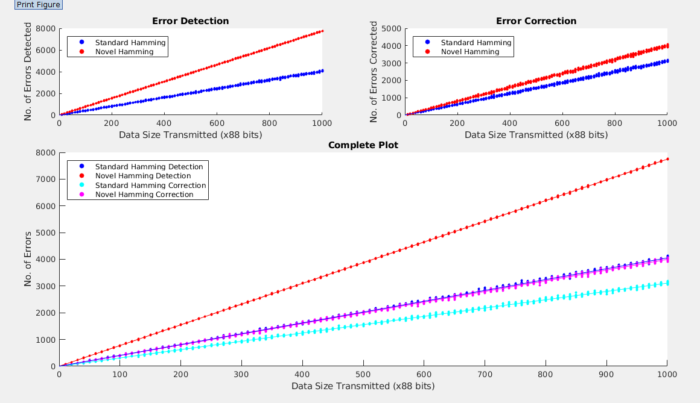

# Data Communications (CO250): Mini-Project

### Title

A Novel Approach to Improving Burst Errors Correction Capability of Hamming Code  

### Members  
1. Gurupungav Narayanan - 16CO114  
2. Nihal Haneef		- 16CO128  
3. Rishika Narayanan 	- 16CO241  

### Abstract

Error detection and correction is critical to accurate data transmission, storage and retrieval. Error correction coding (ECC) has been a crucial part of data transmission or storage. In high-reliability applications, the single error correction and double error detections (SEC-DED) Hamming code may not provide adequate protection against burst errors. This makes multiple-error correction (MEC) highly desirable. This paper proposed a novel approach to improving burst errors correction capability of the extended Hamming Code, with the target objective of minimizing the redundancy, while retaining code rate as maximum as possible. Design algorithms of Hamming encoding and decoding are proposed in this paper along with an innovative mode of transmission, and the simplicity and ease of their implementations are demonstrated with example.  

### Objectives

* Implementing standard hamming code encoding and decoding technique to demonstrate correction and detection of errors during transmission.  
* Implementing the novel hamming code encoding and decoding technique to demonstrate correction and detection of errors during transmission.  
* To implement the above two transmissions over a large dataset for the purpose of plotting graphs and visualising the difference in performance of the two schemes.  
* To simulate a data transmission scenario so as to compare and contrast between both the schemes.  

### Refernces

J. Zhao and Y. Shi, "A Novel Approach to Improving Burst Errors Correction Capability of Hamming Code," 2007 International Conference on Communications, Circuits and Systems, Kokura, 2007.  

## File Structure

* __Introduction.md__ 	: Explain theoretical aspects of the mini project.  
* __Design.md__ 	: Explain design aspects of the mini project.  
* __main.m__ 		: Main module of the implementation and simulation.  
* __dec2binV.m__ 	: Converts a decimal number to its binary form in a row vector.  
* __hamgen.m__ 		: Generates hamming generator matrix G and the check matrix H given redundancy r.
* __std_decode.m__ 	: Decodes a (16,11,4) standard hamming codeword. Returns the codewords after correction.  
* __std_encode.m__ 	: Given data bytes, adds parity bits and returns code word by following the standard hamming code scheme.  
* __nov_encode.m__ 	: Given data bytes, adds parity bits and returns code word by following the novel hamming code scheme.  
* __nov_decode.m__ 	: Decodes a (16,11,4) novel hamming codeword. Returns the codewords after correction.  
* __interleave.m__ 	: Interleaves codewords using interleaving method suggested in the paper.  
* __deinterleave.m__ 	: Deinterleaves codewords using deinterleaving method suggested in the paper.  
* __nicesim.m__ 	: Script to show the basic implementation of the algorithm and its working step byt step. It shows the induction of errors, detection and correction of the same.  
* __plotdata.m__ 	: A Script to plot the comparison between the Novel and Standard hamming code implementations.  
* __simulate.m__ 	: Function to simulate the sending of information bits across a noisy medium by induction of error bits.  
* __compare.m__ 	: This function's purpose is to provide us with data to compare the two hamming code implementations. It calls simulate over the defined input parameters.  
* __datagen.m__ 	: Script to store compare.m return values in a .csv file.  
* __gendataset.csv__ 	: A CSV file which stores the data to be used by plotdata.m .  

### Result Snapshots

